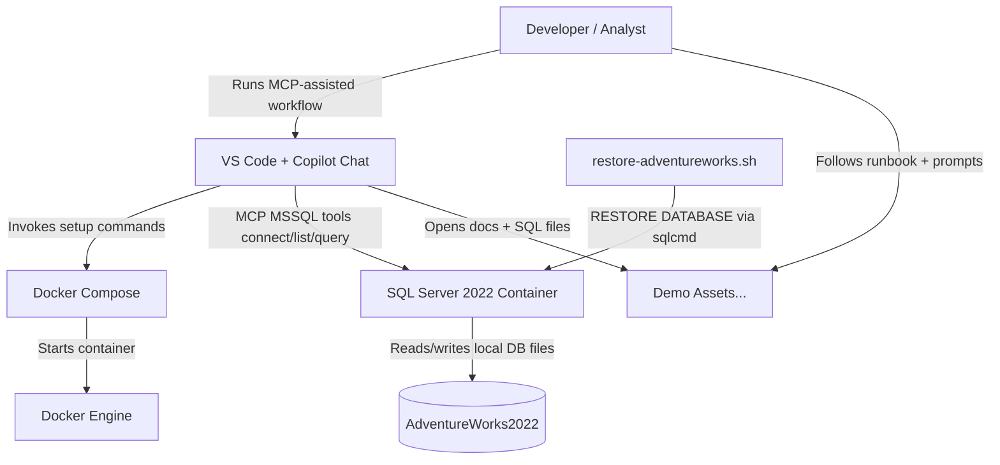
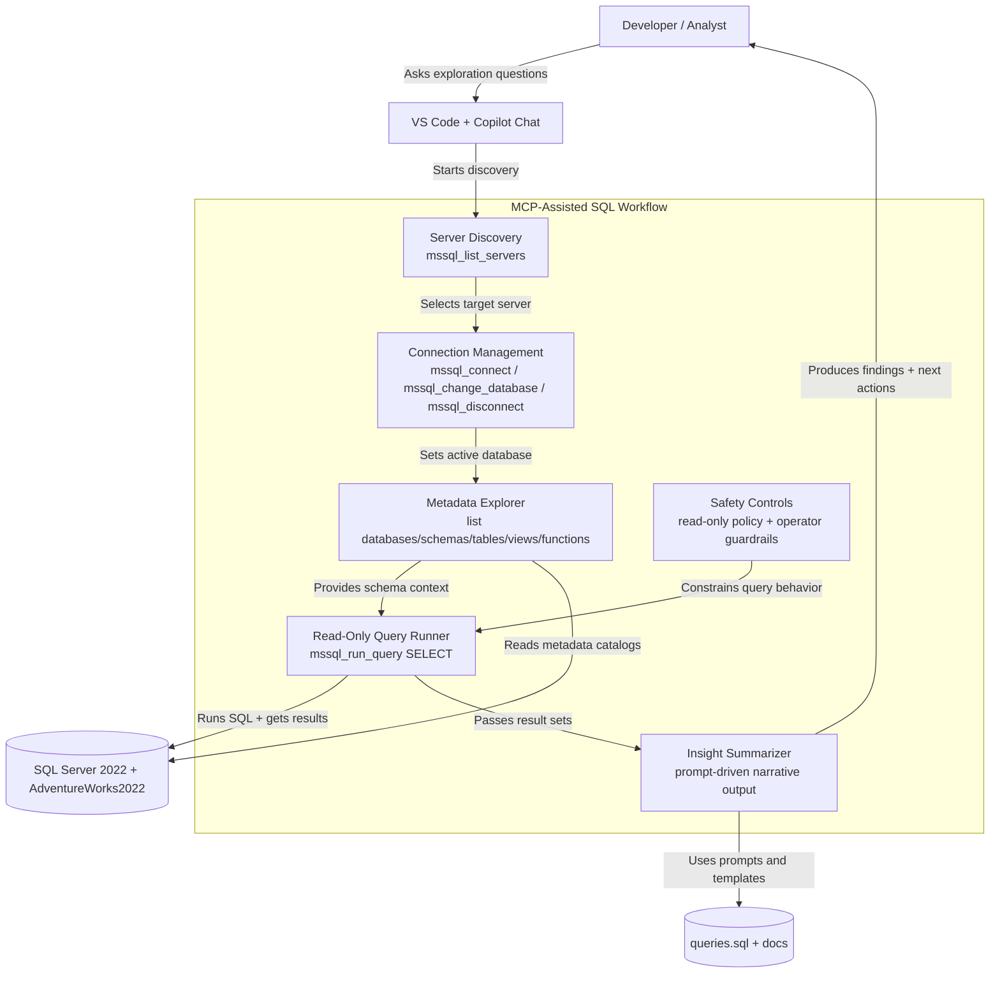

# MCP + SQL Server Demo (Source-Backed Runbook)

Reproducible demo environment for validating SQL Server MCP workflows against `AdventureWorks2022`.

## Architecture at a Glance

### 1) Container View (High-Level)




### 2) Component View (MCP Workflow)




## Quick Navigation

- [MCP + SQL Server Demo (Source-Backed Runbook)](#mcp--sql-server-demo-source-backed-runbook)
	- [Architecture at a Glance](#architecture-at-a-glance)
		- [1) Container View (High-Level)](#1-container-view-high-level)
		- [2) Component View (MCP Workflow)](#2-component-view-mcp-workflow)
	- [Quick Navigation](#quick-navigation)
	- [Versions (Pinned)](#versions-pinned)
	- [Repository Files](#repository-files)
	- [Prerequisites](#prerequisites)
	- [Quick Start](#quick-start)
		- [1) Create local env file](#1-create-local-env-file)
		- [2) Set a strong SA password](#2-set-a-strong-sa-password)
		- [3) Start SQL Server](#3-start-sql-server)
		- [4) Restore AdventureWorks2022](#4-restore-adventureworks2022)
		- [5) Verify database restore](#5-verify-database-restore)
	- [MCP Tool Demo Flow](#mcp-tool-demo-flow)
		- [Demo Query Pass](#demo-query-pass)
		- [Close Safely](#close-safely)
	- [Validation Checklist](#validation-checklist)
	- [Troubleshooting (Basic)](#troubleshooting-basic)
	- [Source References](#source-references)
	- [Safety Notes](#safety-notes)

## Versions (Pinned)

As of 2026-02-17, this demo is pinned to the following:

- SQL Server container image: `mcr.microsoft.com/mssql/server:2022-CU21-ubuntu-22.04`
- SQL tools path inside container: `/opt/mssql-tools18/bin/sqlcmd`
- Sample database backup: `AdventureWorks2022.bak`
- VS Code extension ID: `ms-mssql.mssql` (Marketplace metadata currently shows version `1.39.0`, last updated 2026-01-28)

Why these choices:

- Microsoft Learn quickstart explicitly targets SQL Server 2022 container workflows.
- Docker/MCR listing confirms CU tags and required env vars (`ACCEPT_EULA`, `MSSQL_SA_PASSWORD`).
- AdventureWorks guidance provides version-matched sample backups.

## Repository Files

- `docker-compose.yml` - launches SQL Server with pinned image and persistent volume
- `.env.example` - required env vars and password policy reminder
- `scripts/restore-adventureworks.sh` - downloads + restores `AdventureWorks2022.bak`
- `queries.sql` - three demo analysis queries

## Prerequisites

1. Linux host with x86-64 CPU support for SQL Server Linux containers.
2. Docker installed and running.
3. `curl` available for backup download.
4. VS Code + SQL Server extension (`ms-mssql.mssql`) installed.

## Quick Start

Run commands from `mcp-sqlserver`.

### 1) Create local env file

```bash
cp .env.example .env
```

### 2) Set a strong SA password

```bash
MSSQL_SA_PASSWORD='UseARealStrong!Pass123'
MSSQL_PID='Developer'
MSSQL_HOST_PORT='1433'
```

### 3) Start SQL Server

```bash
docker compose up -d
docker compose ps
```

### 4) Restore AdventureWorks2022

```bash
set -a
source .env
set +a
./scripts/restore-adventureworks.sh
```

### 5) Verify database restore

```bash
docker exec -it mcp-sqlserver-demo /opt/mssql-tools18/bin/sqlcmd \
	-S localhost -U sa -P "$MSSQL_SA_PASSWORD" -C \
	-Q "SELECT name FROM sys.databases ORDER BY name;"
```

## MCP Tool Demo Flow

Goal: prove connection, discovery, and read-only analytics end-to-end.

Before running MCP commands, ensure your local SQL Server is registered in the MSSQL tooling profile list. If `mssql_list_servers` returns an empty list, create a local profile in the VS Code MSSQL extension first.

Run these MCP actions in order:

1. `mssql_list_servers`
2. `mssql_connect` (`serverName=localhost`, `database=master`)
3. `mssql_get_connection_details`
4. `mssql_list_databases`
5. `mssql_change_database` (`AdventureWorks2022`)
6. `mssql_list_schemas`
7. `mssql_list_tables`
8. `mssql_list_views`
9. `mssql_list_functions`
10. `mssql_disconnect`

Expected success signals:

- Server profile list includes `localhost`.
- Connection details show `server=localhost`, `database=master`, `user=sa`.
- Database list includes `AdventureWorks2022`.
- AdventureWorks schemas include `Sales`, `Production`, `Person`, and `HumanResources`.
- Table/view/function lists return non-empty result sets.

### Demo Query Pass

Use statements from `queries.sql` with `mssql_run_query`:

1. Top customers by spend
2. Last 12 full months sales trend
3. Product category performance

Expected: result sets return successfully with useful aggregate metrics.

### Close Safely

- Keep demo read-only (`SELECT` only in public walkthrough)
- End session with `mssql_disconnect`

## Validation Checklist

- [ ] `docker compose ps` shows container running
- [ ] `AdventureWorks2022` appears in `sys.databases`
- [ ] MCP can connect and enumerate databases
- [ ] MCP schema exploration calls return non-empty results
- [ ] All three `queries.sql` queries execute successfully
- [ ] Demo session ends with explicit disconnect

## Troubleshooting (Basic)

- Container exits on startup: SA password likely fails policy; set stronger value in `.env`.
- Login failure from tools: ensure `.env` was sourced before running local commands.
- Port conflict on 1433: set `MSSQL_HOST_PORT` to another free port and restart compose.
- `sqlcmd` path mismatch: use `/opt/mssql-tools18/bin/sqlcmd` for newer images.
- TLS cert error (`certificate verify failed:self-signed certificate`): add `-C` to `sqlcmd` in local container workflows.
- MCP server list empty: configure a SQL connection profile so `mssql_list_servers` can discover `localhost`.

## Source References

- SQL Server Docker image and tags:
	- https://hub.docker.com/r/microsoft/mssql-server
	- https://mcr.microsoft.com/v2/mssql/server/tags/list
- SQL Server container quickstart:
	- https://learn.microsoft.com/en-us/sql/linux/quickstart-install-connect-docker?view=sql-server-ver16
- AdventureWorks install/restore guidance:
	- https://learn.microsoft.com/en-us/sql/samples/adventureworks-install-configure
	- https://github.com/Microsoft/sql-server-samples/releases/tag/adventureworks
- VS Code MSSQL extension:
	- https://marketplace.visualstudio.com/items?itemName=ms-mssql.mssql

## Safety Notes

- Use non-production targets only (local, sanitized restore, or read replica).
- Do not include credentials in screenshots, logs, or recordings.
- Keep destructive SQL out of public demo scripts.

